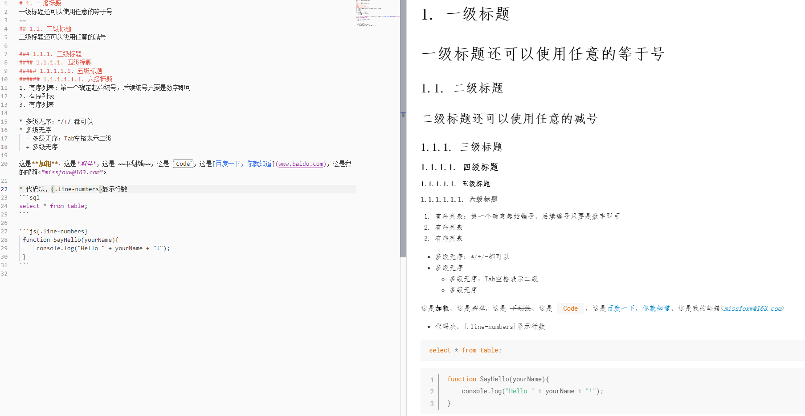
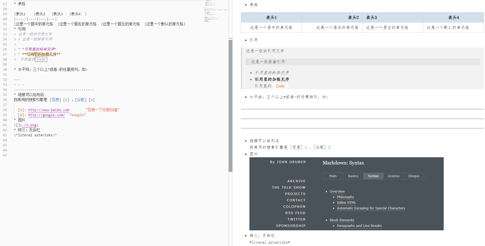

## Markdown
### 介绍
MarkDown是一种轻量级的标记语言，它允许人们使用易读易写的纯本文编写有一定格式的文档；语法十分简单，适合所有人群，方便打开和快速排版，纯文本格式兼容所有的文本编辑器与文字处理软件，可轻松导出HTML,PDF格式。

GitHub,简书，博客园，有道云等都支持Markdown的写作方式。并且配合合适的工具还可以作出优美适宜的图像。

#### 设计理念
Markdown 致力于使阅读和创作文档变得容易。

Markdown 视可读性为最高准则。 Markdown 文件应该以纯文本形式原样发布, 不应该包含标记标签和格式化指令。尽管 Markdown 的语法受到了以下这些 text-to-HTML 过滤器的影响 ——包括 Setext, atx, Textile, reStructuredText, Grutatext, 还有 EtText ——但是 Markdown 语法灵感最大的来源还是纯文本 email 的格式。

基于以上背景, Markdown 完全由标点符号组成, 这些标点经过仔细挑选以使他们看上去和表达的含义相同。例如, 星号标记的单词 `**强调**`就是**强调**； 列表就像是列表； 如果你使用过 email 的话, 就连块引用都像引用的文本段落。

#### 内联 HTML
> 这个特点对程序员尤其是前端程序员真的是非常非常友好了

Markdown 是用于**创作 web 文档**的。

Markdown 从来都不是要取代 HTML。 它的**语法集非常小**, 只对应一小部分 HTML 标签。它要做的 不是 创造一种新的语法以使插入 HTML 标签变得更容易。 在我看来, HTML 标签已经很容易插入了。 Markdown 的目标是易于阅读, 创作和编辑文章。 HTML 是一种 发布 格式; Markdown 是一种 创作 格式。 因此, **Markdown 处理的都是纯文本**。

对于 Markdown 中未包含的标签, 可以直接使用 HTML。没有必要使用定界符或标识符来表明从 Markdown 切换到 HTML; 直接使用标签就行了。

### 基本语法
以下是常用，更多参考[MarkDown中文文档](https://markdown-zh.readthedocs.io)。

###  创建一个MarkDown文件
新建一个文本文件，命名时后缀为md即可。

### 关于添加图片的使用技巧
如果需要在文档中加入小图片，推荐将图片转换为Base64编码格式，mkdocs在构建时会将其解码为图片，省去了使用相对路径的烦恼。

推荐转换网站：http://imgbase64.duoshitong.com/