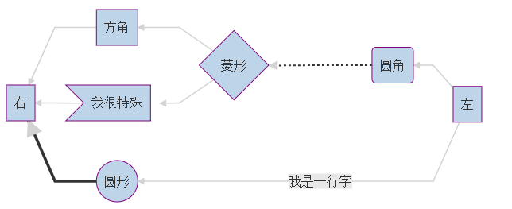

## 插件
### 必备插件
#### 插件列表

|   名称| 说明  |
|---|---|
| Chinese (Simplified) Language <br>Pack for Visual Studio Code  |   简体中文包扩展|
|Markdown Preview Enhanced|Markdown Preview Enhanced <br>是一款为Atom以及Visual Studio Code编辑器编写的超级强大的 Markdown 插件。<br> 这款插件意在让你拥有飘逸的 Markdown 写作体验。|
|Markdown All in One|让你写起文档来更顺手：键盘快捷操作，自动预览等|
| Markdown PDF|如题让你直接从md导出PDF/html/png/jpeg|
|markdown-index|为你的标题自动插入多级编号|

#### 插件安装
点击右边菜单栏扩展商店，搜索扩展，譬如简体中文包扩展，点击【安装】，安装完毕重启编辑器生效。


### Markdown PDF
VSCode本身支持MarkDown语言，并支持实时预览，但是想要导出预览结果需要安装一个插件Markdown PDF。

安装完毕即可在MarkDown文件上右键使用导出工单；或者打开命令面板，搜索`Markdown PDF:Expor (pdf)`


该插件需要机器安装Google Chrome浏览器，如果已经安装google浏览器，可能在导出时会提示Chrome错误，需要做一些配置：

1). 【文件】-【首选项】-【设置】，搜索“markdown-pdf.executablePath”


2). 点击编辑，进入用户设置，在setting.json中新增或修改
`"markdown-pdf.executablePath": "Chrome浏览器的安装路径"`


3). 如果想改导出文件的页眉，也在这里新增，比如我新增的项为：
` "markdown-pdf.headerTemplate": "<div style=\"font-size: 8px; margin-left: auto; margin-right: 1cm; \"> <span>付出不亚于任何人的努力！</span></div>",`

导出结果如下：


### Markdown Preview Enhanced
Markdown Preview Enhanced 是一款为 Atom 以及 Visual Studio Code 编辑器编写的超级强大的 Markdown 插件。 这款插件意在让你拥有飘逸的 Markdown 写作体验。点击进入[中文介绍文档](https://shd101wyy.github.io/markdown-preview-enhanced/#/zh-cn/)

####  一些扩展
##### 图标标记
> 只适用于 markdown-it parser 而不适用于 pandoc parser。
> 缺省下是启用的。你可以在插件设置里禁用此功能。

举一些例子：
```markdown
    |笑脸|小汽车|上标|下标|标记|脚注|缩略|
    |---|---|---|---|---|---|---|
    |:smile:|:fa-car:|30^th^|H~2~O|==marked==| | |

```
|笑脸|小汽车|上标|下标|标记|脚注|缩略|
|---|---|---|---|---|---|---|
|:smile:|:fa-car:|30^th^|H~2~O|==marked==| | |

##### 目录
使用[TOC]可自动生成预览目录，如果不想预显示某级目录，使用 `{ignore=true}`如下图所示：


##### 导入文件
语法`import "你的文件"`，是否够简单呢？你甚至可以知道图片显示的长度、高度、title等等。下面图片的引用语句:
```markdown
import "import.gif {width="600px" height="200px" title="图片的标题" alt="我的 alt"}
```
这意味只你可以把多个文件拼在一起，可以把其他Markdown文件导入显示。


##### 导出
我常用的几个功能：
* 导出html:【右键】-【HTML】-【HTML(offline)】离线html
* 导出html:【右键】-【Open in Browser】在浏览器预览可保存
* 导出PDF:【右键】-【Open in Browser】在浏览器菜单栏【打印】-【另存PDF】


需要额外安装其他脚本使用的功能
1. PhantomJS 支持 pdf，jpeg，以及 png 文件的导出。在使用这个特性之前，请确保你已经安装好了 phantomjs。
2. Chrome(Puppeter)可以导出PDF/PNG/JPEF，你需要预先安装好 puppeteer。
3. eBook要导出电子书，你需要事先安装好 ebook-convert
4. PDF(prince)支持导出PDF，你需要事先安装好 prince。

#### Mermaid图像 
Markdown Preview Enhanced 使用 mermaid 来渲染流程图和时序图。类图和Git版本图暂时不稳定。更多可点击查看[官网文档](https://mermaidjs.github.io/)。

##### 时序图
* -表示实线请求
* --表示虚线反馈
* \>>表示箭头方向
* note表示注释，位置可以 over/right of/left of 


##### 甘特图
* 语法：{code_block=true}可不写，如果写表示既显示图像，又显示画图像的代码
```mermaid{code_block=true}
    gantt
    甘特图的具体内容
```
dateFormat表示甘特图里日期以什么格式书写，title表示标题，section可以划分不同的任务对象。
crit表示重要的事件，可缺省；状态done 表示已完成，active 表示正在执行中；接下来可以给当前任务取一个别名；完成时间可以写开始日期结束日期，也可以写在什么任务完成后，或者直接写需要几天完成。
* 官方例子


* 现在让我们来画一个正在开发的XXX需求实现甘特图

可以看出当前正处于需求开发过程，质量管理 正在编写测试用例，需求设计 正在对开发过程进行关键点把控。


##### 流程图

以下是一个例子，LR表示从左到右，TD和TB都表示从上到下，RL表示从右到左，DT或者BT表示从下到上。语法太简单，直接看例子。





#### 其他渲染
##### 流程图
* 样例


* 样例语句

```flow
    //定义类型和描述（别名）
    st=>start: 开始
    e=>end: 结束
    op1=>operation: 测试上线
    op2=>operation: 返工改bug
    c=>condition: 验证通过？
    io=>inputoutput: 验收报告
    //开始-测试-验证
    st->op1->c
    //验证不通过流转
    c(no)->op2(top)->op1
    //验证通过流转
    c(yes)->io->e   
```

* 组成说明
>  操作块格式：(格式为:变量=>操作块: 备注名)   
    1. start 开始
    2. end 结束
    3. operation 普通操作
    4. condition 判断块
    5. inputoutput 输入输出块
    6. subroutine 子任务块
* 编写说明
    1. 判断流程控制   
    - yes（验证通过）下一步走向操作3（验收）：  
    cond(yes)->op3 
    2. 位置制定
    - 操作2（改bug）下一步从右边输出到操作1（测试上线）：
    op2(right)->op1
    - 判断流程的位置left设置不生效，可以写成：
    cond(no，right)
    3. 流程控制
        - 可以合并写：
        cond(no)->op2(top)->op1；
        - 也可以分开写：  
        cond(no)->op2
        op2(right)->op1

#####  时序图
支持两个主题 simple（默认主题）和 hand；
* 语法

```
sequence{theme="hand"}//主题设置为hand，显示为手写模式
    A->B: 发送请求
    B-->A: 反馈结果
```


* 样例（默认主题）

```sequence{code_block=true}
    A->B: 发送请求
    B-->A: 反馈结果
```


##### 静态图像
* 语法
```markdown
    vega-lite
    {
    //在这里编写，data数据可自行编写，也可来源csv/json等
    //mark 表示图形类型：bar柱状，pie饼状图，point散点图，line折线图
    }
```
* 柱状图呈现
```vega-lite{code_block=true}
{
    "width": 600,
    "height": 200,
    "title":"2018年各月XX变化柱状图",
    "data": {
    "values": [
        {"a": 1,"b": 3}, {"a": 2,"b": 7}, {"a": 3,"b": 5}, 
        {"a": 4,"b": 8}, {"a": 5,"b": 2}, {"a": 6,"b": 4}, 
        {"a": 7,"b": 1}, {"a": 8,"b": 7}, {"a": 9,"b": 8}, 
        {"a": 10,"b": 5}, {"a": 11,"b": 3}, {"a": 12,"b": 2}
    ]},
  "mark": "bar",
  "encoding": {
    "x": {"field": "a", "type": "ordinal"},
    "y": {"field": "b", "type": "quantitative"}
  }
}
```


* 多系列折现形图
```vega-lite{code_block=true}
{
    "width": 600,
    "height": 200,
    "title":"早晚XX变化折现图对比",
    "data": {
        "values": [
        {"a": "A","b": 55,"color": "早"},{"a": "A","b": 34,"color": "晚"},
        {"a": "B","b": 13,"color": "早"},{"a": "B","b": 65,"color": "晚"},
        {"a": "C","b": 28,"color": "早"},{"a": "C","b": 22,"color": "晚"},
        {"a": "E","b": 28,"color": "早"},{"a": "E","b": 18,"color": "晚"},
        {"a": "F","b": 58,"color": "早"},{"a": "F","b": 56,"color": "晚"},
        {"a": "G","b": 48,"color": "早"},{"a": "G","b": 98,"color": "晚"},
        {"a": "H","b": 68,"color": "早"},{"a": "H","b": 109,"color": "晚"},
        {"a": "I","b": 38,"color": "早"},{"a": "I","b": 12,"color": "晚"}
        ]
    },
    "mark": "line",
    "encoding": {
        "x": {"field": "a", "type": "ordinal","title":""},
        "y": {"field": "b", "type": "quantitative","title":""},
        "color": { "field": "color","title":""}
    }
}
```


### PlantUML
Markdown Preview Enhanced 可以使用 PlantUML 来创建各种图形。（需要先安装Java）

PlantUML是一个开源项目,非常强大，画出的UML图也非常美观；同时也支持非UML图。深入了解可访问[PlantUML](http://plantuml.com/).

下面是一个时序图例子:
```puml
张三 -> 李四:你还好吗?

loop 健康
李四->李四:身体检查
end loop

李四 --> 张三:我现在身体很好

王五 -> 李四:你还好吗?
李四 --> 王五:我现在身体很好

note over 王五:这是一个时序图样例的note
```


### markdown-index
插件只适用于#标记的标题，如图所示，使Ctrl+shift+Pd打开命令面板，搜索`Markdown add index`。
