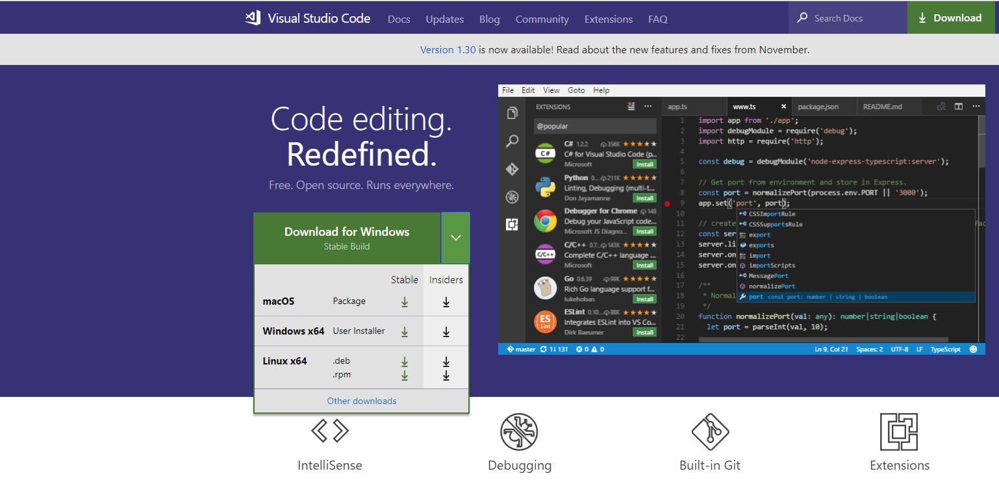
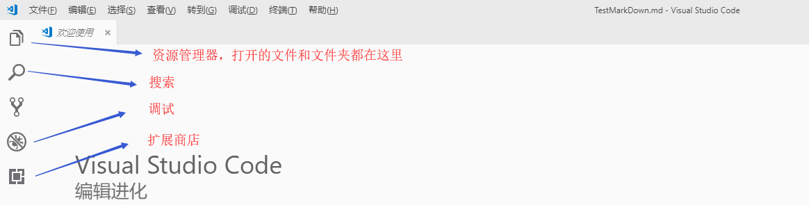
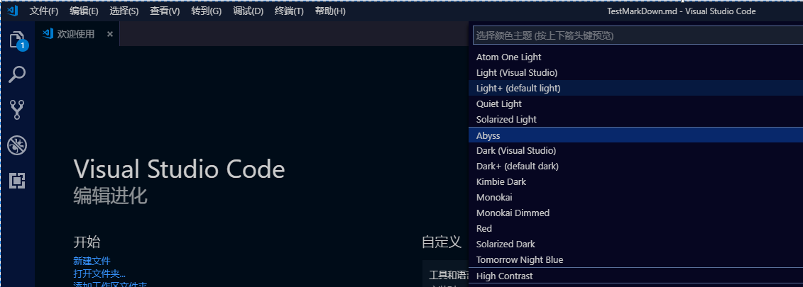

## VsCode
### 介绍
Visual Studio Code(以下简称VSCode)是一个轻量级但功能强大的源代码编辑器，可以在桌面上运行，适用于Windows、macOS和Linux。它内置了对JavaScript、TypeScript和Node的支持。它拥有丰富的生态系统，可以扩展到其他语言(如c++、c#、Java、Python、PHP、Go)和运行时(如. net和Unity)。

本文只探讨VSCode和Markdown结合产生的奇妙化学反应，期望能给诸多文档编写者带来惊艳的体验。这只是它诸多功能中的冰山一角。

**关键词**：开源，跨平台，轻量级，富插件
### 安装

1. 下载安装包，VSCode官网：[点击进入下载](https:/img/code.visualstudio.com)
2. 下载之后，运行安装程序(VSCodeUserSetup-{version}.exe)。这只需要一分钟。
3. 默认情况下，VS代码安装在C:\users\{username}\AppData\Local\Programs\Microsoft VS Code。

另外，您还可以下载Zip归档文件，提取它并从中运行代码。跟上面那种安装比差在不会自动更新。

> 注意：本文档所有例子基于Windows x64 10,Visual Studio Code1.3.0版本。

> 注意:VS代码需要. net Framework 4.5.2或更高版本。如果您使用的是Windows 7，请确保至少安装了. net Framework 4.5.2。
 
> 提示:安装程序会将Visual Studio Code添加到您的%PATH%中，所以您可以从控制台通过键入"code"快捷进入VSCode编辑器

更多参考[官网安装文档](https:/img/code.visualstudio.com/docs/setup/windows)

### 个性化设置
#### 中文扩展
第一步可以安装中文扩展包，扩展包安装详见[4.1.2. 插件安装](#4.1.2.-插件安装),安装完毕打开编辑器如下：

#### 帮助和个性化
* 菜单栏【帮助】内包含很多使用技巧，这里列举几个常用的
    * Ctrl+shift+P 打开命令面板
    * Ctrl+P 打开搜索文件面板
    * Alt+Z可切换自动换行，更多类似设置可点击菜单看【查看】
    * 右下角可点击交互：更改语言、编码等等
  

* 【文件】-【首选项】-【颜色主题】,可选择主题样式，可以选择你喜欢的写作主题。Ctrl+K Ctrl+T快捷键也可以打开。

